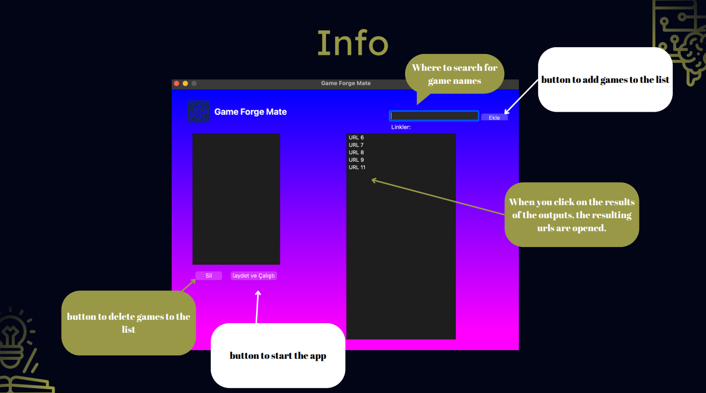

# Game Forge Mate

# System Requirements Manager

This Python-based project aims to provide users with an application that suggests minimum system requirements for the games they choose. The project performs a performance ranking on the backend using GPU and CPU UserBenchmark scores obtained from the internet, tailored to the user's selected games.

## Features

- Calculates minimum system requirements based on the user's selected games.
- After comparing the performance ranking of games with backend software, it presents the best components or system to the user.
- Determines the most powerful system among the selected games and retrieves the product link from the internet.

## Technologies Used

- Python: The project is implemented in Python.
- Web Scraping: Retrieves the links of hardware components of the selected system after confirming the best system. Alternatively, if there is a system that includes these components, it provides the link to the user.
- Firebase: Used for storing, manipulating, and retrieving data.

## How to Use?

1. The user selects the games and requests a computer that meets the minimum system requirements.
2. The application retrieves the UserBenchmark scores of the selected games and determines the performance ranking with backend software.
3. Identifies the most powerful system, fetches the product link from the internet, and presents it to the user.

## Installation

You can access the project code [here](https://github.com/Vladexxs/Game-Forge-Mate/tree/main/SystemFinder). Also, don't forget to install the necessary dependencies to run the project.

## Members
- Gürkan Karadaş [@imacapella](https://github.com/imacapella)
- Mert Yılmazer  [@Vladexxs](https://github.com/Vladexxs)
- Murathan Karasu
